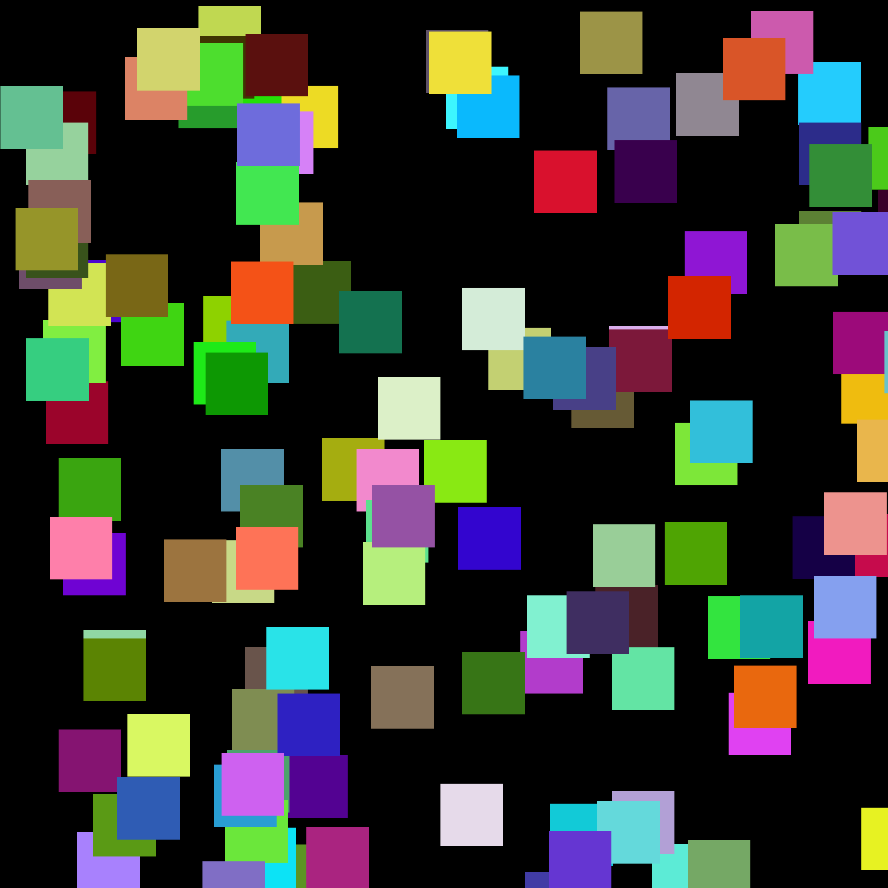
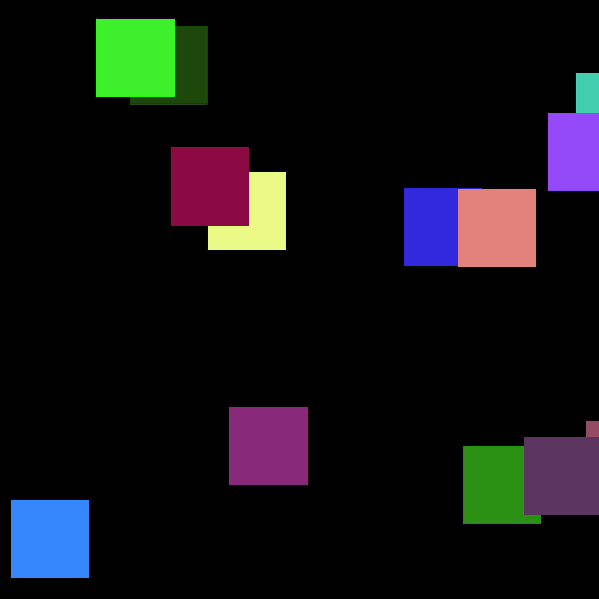
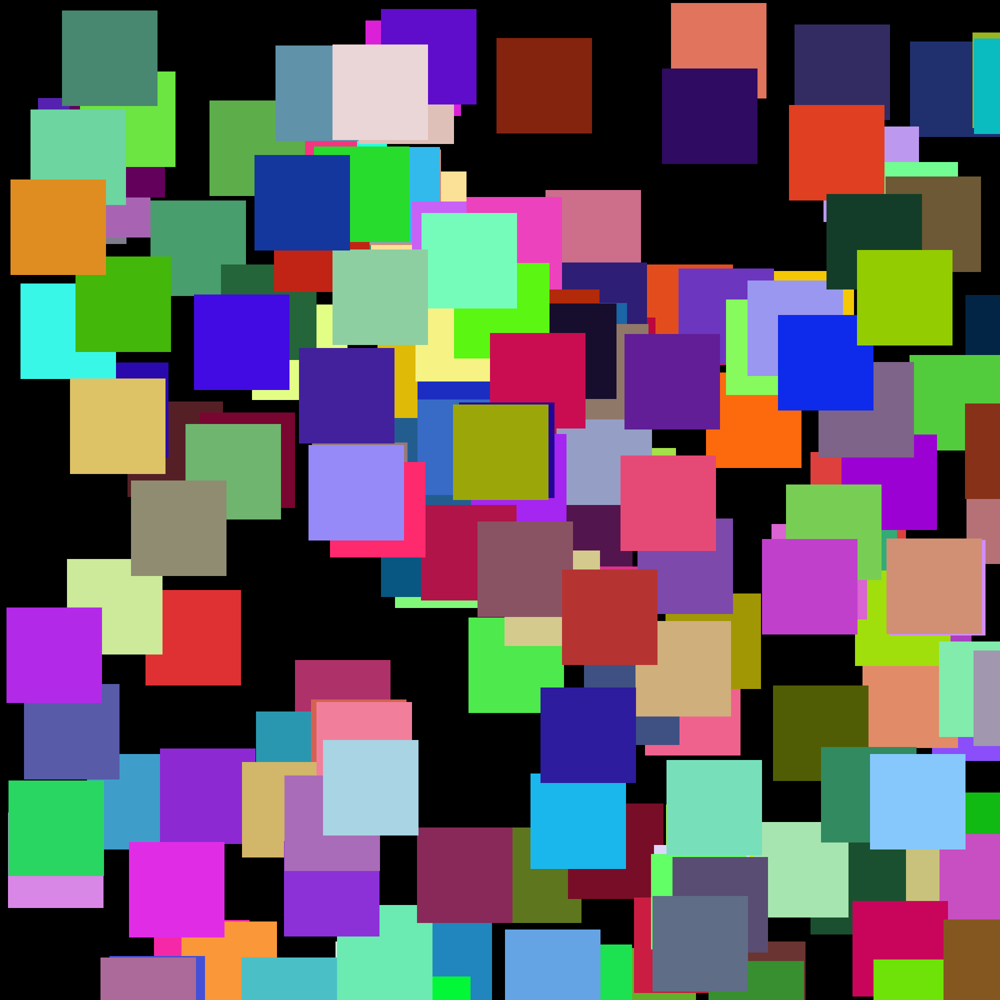

## Using PIL ##
Generative artwork made with `PIL` library to paint squares on a canvas.

----
## Installation ##
To install run:
```sh
pip install -r ../requirements.txt
```

----
## Usage ##
To run the code:
```sh
python pil_generative_art.py
```

----
## Results ##
Outputs are stored in [`outputs/`](./outputs/).

Some example outputs:<br>
> &nbsp;&nbsp;&nbsp;&nbsp;&nbsp;
> &nbsp;&nbsp;&nbsp;&nbsp;&nbsp;
> 
